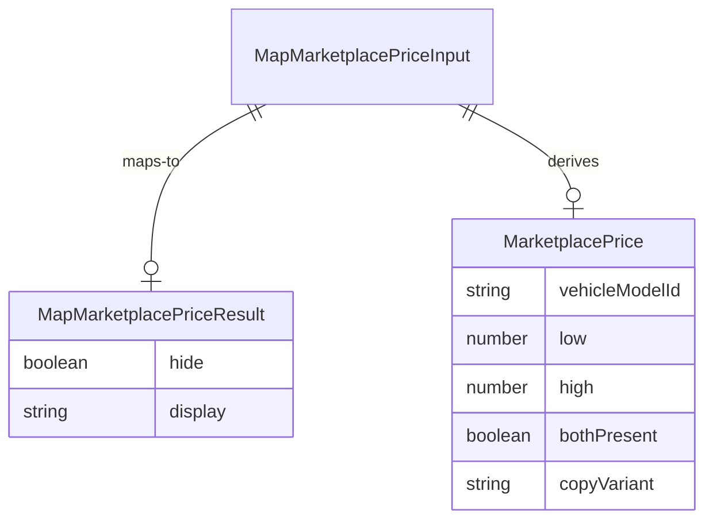

# Functional Spec — marketplace-price-mapper

Behavioural specification for U1 (library). Workflows below are authoritative. Entity shapes come from `entities.md`; decision rules from `rules.md`.

## Purpose

Provide one sync in-repo function that turns a placement’s marketplace pair into hide-or-display so U2–U5 cannot drift on FR5.

## Workflow W1 — Map settled marketplace price

1. Caller builds `MapMarketplacePriceInput` (including `vehicleModelId` it already has, `formatDollars`, flags, low/high, `copyVariant`, `originalMsrpCopy`).
2. Mapper evaluates BR1.1–BR1.9 in order of precedence:
   1. If `inFlight` → result `{ hide: true, display: null }` (BR1.1). Stop.
   2. If `readFailed` → `{ hide: false, display: originalMsrpCopy }` (BR1.6). Stop.
   3. Compute `bothPresent` per BR1.2.
   4. If `bothPresent` and `copyVariant` is `hero-range` → `{ hide: false, display: Marketplace string }` (BR1.3, BR1.7).
   5. If `bothPresent` and `copyVariant` is `starting-at` → `{ hide: false, display: starting-at string }` (BR1.4, BR1.7).
   6. Else → `{ hide: false, display: originalMsrpCopy }` (BR1.5).
3. Caller renders: if `hide`, do not show the price slot contents; else show `display` in existing chrome.

## Workflow W2 — In-flight then settle

1. Caller sets `inFlight=true` while its `vehicle_models` read is outstanding → W1 step 2.1 (hide).
2. On settle success, caller sets `inFlight=false`, `readFailed=false`, and passes low/high → W1 steps 2.3–2.6.
3. On settle failure/timeout, caller sets `inFlight=false`, `readFailed=true` → W1 step 2.2.

No mapper-owned state machine across calls: each invocation is pure and independent. Callers own GraphQL lifecycle (BR1.8).

## Derived ER view

Text fallback: Input maps to a Result. MarketplacePrice is a derived value for identity and presence; it is not returned on the call (Q4 A).

## Derived rules summary

| ID | Applies when | Outcome |
|----|--------------|---------|
| BR1.1 | inFlight | hide |
| BR1.6 | readFailed | Original MSRP display |
| BR1.2–BR1.4 | both present + variant | marketplace copy |
| BR1.5 | not both present | Original MSRP display |
| BR1.7–BR1.9 | always | `$` formatter; no fetch; id identity-only |

## Out of scope for this unit

- GraphQL query files and fetch (U2–U5)
- Slot chrome, shrink-to-one-line, click-through (U2–U5)
- Shared price-slot UI, new AWS, new analytics

## Review

**Verdict:** READY
**Reviewer:** aidlc-architecture-reviewer-agent
**Date:** 2026-09-08T18:15:00Z
**Iteration:** 1

### Findings

| ID | Severity | Location | Finding | Required action | Status |
|---|---|---|---|---|---|
| R-01 | Major | aidlc/spaces/default/intents/260904-mvp/construction/marketplace-price-mapper/functional-design/traceability.json > reverse BR1.1 | BR1.1 (hide while `inFlight`) is reverse-mapped with status `OK` and the claim that it is “covered with settled ACs via W2”. AC1.1.1–AC4.1.3 only assert settled marketplace or Original MSRP copy; none assert an empty/hidden slot during an in-flight read. W2 step 1 is design-only. The `OK` coverage claim is false and can cause Code Generation / QA to skip the hide path that `unit-of-work.md` lists as a U1 responsibility. | Change reverse BR1.1 to status `N/A` with an honest rationale (refined-mockups / unit responsibility; no story AC), or add a unit-level acceptance criterion / fixture that Then-asserts hide while `inFlight=true` and retarget an `OK` row at BR1.1. Do not claim settled ACs cover hide. | New |
| R-02 | Major | aidlc/spaces/default/intents/260904-mvp/construction/marketplace-price-mapper/functional-design/entities.md > MarketplacePrice; functional-spec.md > Workflow W1 / Derived ER view; rules.md > BR1.9 | U1 is said to own `MarketplacePrice` (`unit-of-work.md`, `components.md`), and the ER view shows Input deriving `MarketplacePrice` on the call. Q4 A / `MapMarketplacePriceResult` return only `{ hide, display }`. W1 never constructs `MarketplacePrice`. BR1.9 / Q3b A say `vehicleModelId` is “stored” for identity/tracing, but with no returned entity, persistence, or log sink there is nowhere to store it. Implementers must guess whether to export a `MarketplacePrice` type, build an unused intermediate, or reduce the model to a local `bothPresent` boolean plus a dead required id. | State explicitly that `MarketplacePrice` is a logical/internal value object (not part of C1–C4 wire output), whether it is exported, and that `vehicleModelId` is required call validation only (discarded after presence check) unless you name a real tracing sink. Align W1 with that lifecycle (build it or drop the ER “derives” edge). | New |
| R-03 | Minor | aidlc/spaces/default/intents/260904-mvp/construction/marketplace-price-mapper/functional-design/functional-spec.md > Workflow W1 step 2 | Step 2 says BR1.1–BR1.9 are evaluated “in order of precedence,” but BR1.7–BR1.9 are always-on constraints, not ordered branches. Only BR1.1 → BR1.6 → BR1.2 → BR1.3/BR1.4/BR1.5 form the precedence ladder. | Rephrase step 2 so precedence lists only BR1.1, BR1.6, BR1.2, BR1.3/BR1.4/BR1.5, and note BR1.7–BR1.9 as standing constraints on every call. | New |
| R-04 | Minor | aidlc/spaces/default/intents/260904-mvp/construction/marketplace-price-mapper/functional-design/functional-spec.md > Derived ER view mermaid | Mermaid types `MarketplacePrice.low`/`high` and `MapMarketplacePriceResult.display` as non-null `number`/`string`, while `entities.md` allows `number \| null` and `display` null when `hide` is true. | Adjust the derived diagram (or its text fallback) to show nullability so it cannot drift from the entities YAML source of truth. | New |

### Validation Tool Results

| Tool | Result | Interpretation |
|---|---|---|
| `date -u +"%Y-%m-%dT%H:%M:%SZ"` | Hook-denied | PreToolUse blocked Shell. Date uses dispatch fallback `2026-09-08T18:15:00Z`. |
| Stage frontmatter validation tools | None listed | No engine validator named on the stage; sensors are gate-fired. Manual checks below. |
| `aidlc-sensor-required-sections.ts` | Hook-denied; manual PASS | `entities.md`, `rules.md`, and `functional-spec.md` each have ≥2 H2s; entities/rules carry fenced YAML SoT blocks. |
| `aidlc-sensor-traceability.ts` | Hook-denied; manual PASS with caveat | All 16 ACs listed; OK rows target existing BR1.2–BR1.7 IDs; click-through ACs are N/A; BR1.8/BR1.9 reverse N/A. BR1.1 reverse `OK` claim is misleading (finding R-01) but not a mechanical GAP/ORPHAN. |
| Confirmed Q1–Q4 vs artifacts (manual) | PASS | `formatDollars` includes `$` (BR1.7/entities); finite incl. 0 (BR1.2); `vehicleModelId` identity-only (BR1.9); return `{ hide, display }` only (entities/Q4 A). |
| Contract C1–C4 alignment (manual) | PASS | Input/output fields and precedence (inFlight → readFailed → both present → MSRP) match `contract-summary.md`; FD pins presence and `formatDollars` typing left open on the shared contract. |
| Cross-unit / cycle (manual) | PASS | Library has no outbound unit deps; no circular entity refs; GraphQL/fetch stays on U2–U5 (BR1.8). |

### Summary

Precedence, copy templates, presence (incl. 0), and `{ hide, display }` match the confirmed answers and C1–C4, so a developer can implement the mapper. Weigh the two Majors before approving: fix the false BR1.1 AC-coverage claim, and pin whether `MarketplacePrice`/`vehicleModelId` are internal-only given Q4 A.
