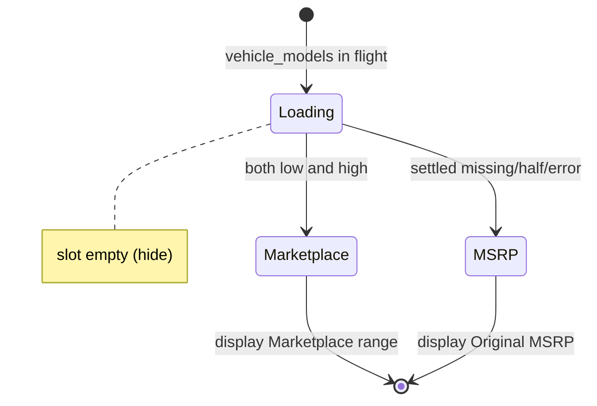

# Functional Spec — mmp-hero

Behavioural specification for U2 (ui). Implements US1.1 on the Car and Driver make/model review-article hero. Workflows below are authoritative. Mapper rules live in U1 `functional-spec.md` / C1; this unit owns GraphQL selection, flag wiring, slot render, and unchanged click-through.

## Purpose

Wire the existing CAD MMP hero price slot to U1 `mapMarketplacePrice` so shoppers see `Marketplace  $LOW - $HIGH` when both marketplace prices are present, hide the slot while the hero’s `vehicle_models` read is in flight, fall back to Original MSRP otherwise, and keep the existing marketplace listing click-through.

## Components in scope

| FRE surface | Role |
|-------------|------|
| `caranddriver/components/content/fragments/vehicle-model.js` | Add `marketplace { high low }` under the hero year `price` selection in `VehicleModelFragment` |
| `caranddriver/components/content/review/hero-section/index.jsx` | Pass settled marketplace fields, loading/error flags, and model id into price section |
| `caranddriver/components/content/review/hero-section/price-section/index.jsx` | Call U1; render hide / marketplace / MSRP fallback; keep `MarketplaceCta` |
| `@autos/utils/map-marketplace-price` | U1 library (already shipped) |

Out of scope: MotorTrend hero, ranking/card/category placements, mapper implementation changes, new buttons, new analytics, new AWS.

## Workflow W1 — Render hero price on settled SSR

1. Review-article data loader runs `VEHICLE_DATA_QUERY` with `VehicleModelFragment` (includes marketplace low/high on the hero year price).
2. Hero resolves the current model year object and Voltron `price` (existing MSRP source) plus marketplace `low`/`high` from the fragment.
3. Build `originalMsrpCopy` = existing `getFormattedPriceRange(price, …)` output (include ` est` when `is_estimate`).
4. Build `formatDollars` from `@caranddriver/page-utils/price-utils` (single amount with leading `$`, U1 Q1 A).
5. Call `mapMarketplacePrice` with:
   - `vehicleModelId`: model id already on hero data
   - `inFlight: false`, `readFailed: false` at SSR first paint
   - `low` / `high`: marketplace numbers from GraphQL when present
   - `copyVariant: 'hero-range'`
   - `originalMsrpCopy`, `formatDollars`
6. Apply result to slot:
   - `hide: true` → render **no** price title or price text (empty slot box per interaction-spec)
   - `hide: false` and marketplace copy → render **`display` only** (includes `Marketplace  …` prefix); **no** separate `MSRP` title
   - `hide: false` and MSRP fallback → render **`MSRP` title + `display`** (today’s layout)
7. When marketplace ingress is on, wrap visible price text in existing `MarketplaceCta` (`variant="hero-price"`, same `href` as today). Do not change shop CTAs, trade-in, or forecast links.

## Workflow W2 — Hide while read in flight

1. On client-side hero vehicle read (refetch / route transition), set `inFlight: true` before settle.
2. Call mapper → `{ hide: true, display: null }` (U1 BR1.1).
3. Price section renders empty slot (no MSRP, no marketplace text).
4. On settle, run W1 step 5–7 with updated flags and fields.

## Workflow W3 — Read failure / timeout

1. When the hero’s vehicle GraphQL read errors or times out, set `readFailed: true`, `inFlight: false`, marketplace fields absent.
2. Mapper returns Original MSRP (`display: originalMsrpCopy`).
3. Render MSRP fallback layout (W1 step 6 third branch).
4. Existing click-through remains available when ingress allows (AC1.1.4).

## Workflow W4 — Click-through (unchanged)

1. Shopper sees hero with marketplace or MSRP copy (W1/W3).
2. Shopper activates the **existing** hero price link (`MarketplaceCta` when ingress on) or other existing shop controls.
3. Navigation uses existing `getMarketplaceHref*` helpers → marketplace inventory listing for the model (FR1.3). No new control, no VDP destination.

## State view

Text fallback: in flight → empty slot; settled with both prices → marketplace string; otherwise → Original MSRP with existing click-through.

## Acceptance mapping

| AC | Workflow |
|----|----------|
| AC1.1.1 | W1 marketplace branch |
| AC1.1.2 | W1 MSRP fallback branch |
| AC1.1.3 | W3 |
| AC1.1.4 | W4 |

## Assumptions & Open Questions

None.

## Review

**Verdict:** READY
**Reviewer:** aidlc-architecture-reviewer-agent
**Date:** 2026-09-08T19:20:00Z
**Iteration:** 1

### Findings

| ID | Severity | Location | Finding | Required action | Status |
|---|---|---|---|---|---|
| R-01 | Minor | aidlc/spaces/default/intents/260904-mvp/construction/mmp-hero/functional-design/functional-spec.md > State view | The state diagram shows `Loading` only on initial entry. It omits the `Marketplace`/`MSRP` → `Loading` edge on client refetch (W2), so implementers relying on the diagram alone may miss the return-to-hide path. | Add a refetch transition back to `Loading` on `inFlight`, or note in the text fallback that settled states re-enter `Loading` during client vehicle read. | New |
| R-02 | Minor | aidlc/spaces/default/intents/260904-mvp/construction/mmp-hero/functional-design/functional-spec.md > Workflow W1 step 6; frontend-components.md > Internal behaviour step 5 | W1 distinguishes marketplace vs MSRP fallback branches but does not pin how the price section tells them apart. `frontend-components.md` uses `display starts with Marketplace`, which is fragile if copy ever changes. | State the branch rule in W1 (e.g. `display !== originalMsrpCopy` after mapper settle, or an explicit marketplace-copy predicate aligned with U1 `hero-range` output). | New |
| R-03 | Minor | aidlc/spaces/default/intents/260904-mvp/construction/mmp-hero/functional-design/rules.md > BR2.3 source | BR2.3 cites `FR5`, but FR5.1–FR5.3 cover presence, error fallback, and click-through on MSRP — not hide-while-in-flight. The behaviour is correct and traceability reverse `N/A` is honest; the source tag is slightly misleading. | Point BR2.3 `source` at `interaction-spec.md` hero loading state (and/or refined-mockups Q1 C) instead of FR5 alone. | New |
| R-04 | Minor | aidlc/spaces/default/intents/260904-mvp/construction/mmp-hero/functional-design/functional-spec.md > Workflow W3 | `functional-design-questions.md` Q6 A requires SSR loader failure to set `readFailed=true` alongside existing page error handling. W3 only names query error/timeout on the hero vehicle read. | Add one line to W3 for SSR loader failure: if the hero vehicle read never settles, pass `readFailed=true` (or document that page-level error handling prevents price-section render). | New |

### Validation Tool Results

| Tool | Result | Interpretation |
|---|---|---|
| `date -u +"%Y-%m-%dT%H:%M:%SZ"` | Hook-denied | PreToolUse blocked Shell. Date uses dispatch fallback `2026-09-08T19:20:00Z`. |
| Stage frontmatter validation tools | None listed | No engine validator named on the stage; manual checks below. |
| CAD-only scope (manual) | PASS | Q1 A, out-of-scope list, and FRE paths are CAD review-article hero only; MotorTrend excluded. |
| C1 / U1 mapper wiring (manual) | PASS | `copyVariant: hero-range`, `formatDollars`, `inFlight`/`readFailed` precedence, and `{ hide, display }` match `contract-summary.md` C1 and U1 `functional-spec.md`. |
| FR1 / FR5 / AC1.1.x alignment (manual) | PASS | W1–W4 and BR2.2–BR2.8 cover marketplace copy, MSRP fallback, read failure, and unchanged click-through per `requirements.md` FR1.1–FR1.3, FR5.1–FR5.2, and `stories.md` AC1.1.1–AC1.1.4. |
| Traceability forward (manual) | PASS | AC1.1.1→BR2.2/BR2.4; AC1.1.2→BR2.5/BR2.6; AC1.1.3→BR2.7; AC1.1.4→BR2.8; AC2–AC4 honestly N/A to sibling units. |
| Traceability reverse / BR2.3 honesty (manual) | PASS | BR2.1 and BR2.3 reverse `N/A` with accurate rationales (GraphQL enabler; in-flight hide has no dedicated AC — unlike U1 BR1.1 false-OK). BR2.2/BR2.4–BR2.8 covered forward. |
| GraphQL fragment extension (manual) | PASS | BR2.1 / W1 step 1 extend `VehicleModelFragment` with `marketplace { high low }` on hero year `price`; violation rejects separate fetch. |

### Summary

CAD hero functional design is implementable: FRE paths, fragment extension, U1 `hero-range` wiring, hide/inFlight/readFailed, MSRP-title vs marketplace display, and unchanged click-through align with C1 and AC1.1.x; traceability and BR2.3 reverse N/A are honest. Four Minors polish the state diagram, branch-detection rule, BR2.3 source citation, and SSR loader-failure note — none block Code Generation.
