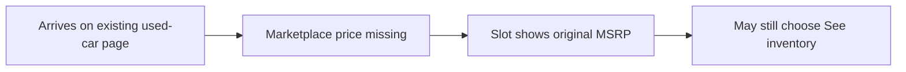

# User Flow

Shopper flow for the four placements in `scope-document.md` and `intent-backlog.md`, matching the problem in `intent-statement.md`.

## Happy path

An external used-car shopper on Car and Driver hits an existing placement, reads a marketplace price range, and follows that price into marketplace inventory. [Q2][Q3]

Text fallback: shopper arrives on an existing used-car page → sees $LOW–$HIGH on hero, ranking, card back, or category card → chooses See inventory → lands on marketplace inventory.

```mermaid
flowchart LR
  arrive[Arrives on existing used-car page] --> see[Sees marketplace range on a placement]
  see --> click[Chooses See inventory]
  click --> inventory[Marketplace inventory]
```

## Missing-price path

When marketplace price is missing, the slot stays and shows original MSRP. The shopper can still use See inventory. This is the empty state, not the happy path. [Q4]

Text fallback: shopper arrives → placement has no marketplace range → slot shows original MSRP → shopper may still choose See inventory.



## Coverage

The same two paths apply to all four must-have placements (U1 hero, U2 ranking, U3 card backs, U4 category cards). No extra step before click-through. [Q2]

No new page is introduced. The flow starts on current page homes and ends at existing marketplace inventory. [Q1]

## Assumptions & Open Questions

- Where marketplace inventory lands (existing marketplace results vs a vehicle-detail page) is not named beyond "marketplace inventory."
