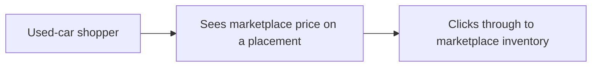

# Scope Document

Scope for the intent in `intent-statement.md`, checked against `feasibility-assessment.md` and `constraint-register.md`.

## In Scope

- Marketplace prices on all four used-car placements: MMP hero, MMP ranking, vehicle-card backs, and category cards. [Q1]
- All four placements ship together as the first delivered increment. A single placement is not enough shopper value. [Q1]
- Launch bar: each placement correctly shows current marketplace prices in place of original MSRP or MSRP ranges. [Q7]
- After launch, observe click-through from those placements to marketplace inventory, plus vehicle-detail views and lead start/submit where measurable. Those measures are not the launch bar. [Q7]

## Out of Scope

- Backend work. [Q3]
- New-car pricing changes. [Q3]
- Trim-, VIN-, or location-specific pricing. [Q3]

## Boundaries

- The product boundary is the four placements named above. [Q1]
- If the 2-week date slips, keep all four placements and move the date. Do not drop a placement to hit the calendar. [Q2][Q6]
- The 2-week date applies to all four placements. [Q6]
- Each placement can ship on its own from a dependency view; value is still counted only when all four have shipped. [Q1][Q4]
- Work stays on the existing used-car page modules and the existing marketplace price API already named in `constraint-register.md`. No new cloud account or service. [constraint-register]
- Displayed prices are public marketplace figures. No new personal data is collected. [constraint-register]

## Value Stream

Used-car shopper researching on Car and Driver → sees current marketplace prices on a used-car placement instead of original MSRP → clicks through to marketplace inventory.

Text fallback: a shopper hits one of the four placements, reads a current marketplace price, and can follow that price into marketplace inventory. The stream is complete for this MVP only when that path exists on hero, ranking, vehicle-card backs, and category cards.

## Assumptions & Open Questions

- Which of the four placements is the first risk-reduction placement is not named. [Q5]
- Whether four unbuilt placements can actually finish in 2 weeks remains unproven (`feasibility-assessment.md`).
