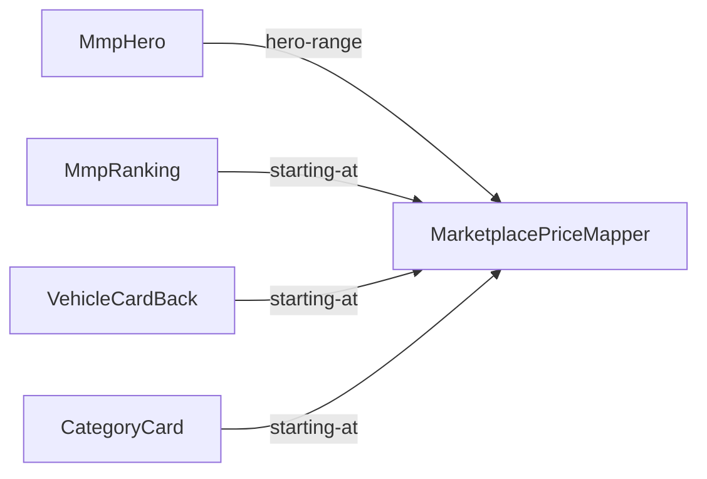

# Domain Components

Logical building blocks for US1.1–US4.1 in `stories.md` and FR1–FR5 in `requirements.md`. Affirmed practices in `team-practices.md`. No new AWS. Price source is current GraphQL `vehicle_models` (Q2 X confirmed).

The only **new** building block is `MarketplacePriceMapper`. The four placements are existing FRE modules that call that mapper and keep their own price-slot chrome (`domain-design-questions.md` Q1 A, Q5 A). They are not new adapter components.

Each placement keeps its own `vehicle_models` query file. This increment adds `price { marketplace { high low } }` on those files so the mapper can read high and low (`domain-design-questions.md` Q2 X). No shared fetch.

```yaml
components:
  - name: MarketplacePriceMapper
    summary: Shared rules that turn a vehicle_models marketplace pair into hide, marketplace copy, or Original MSRP
    behaviour: >
      Pure mapping. Does not fetch. The caller passes copyVariant (hero-range
      or starting-at), in-flight vs settled fields, and the Original MSRP
      copy the slot already uses. While that placement's vehicle_models read
      is in flight, say the slot should hide. After the read settles,
      marketplace copy appears only when both low and high are present:
      hero-range yields Marketplace $LOW - $HIGH; starting-at yields
      starting at {low}. Missing, one-of-two, error, or timeout returns the
      Original MSRP copy the caller already has. Dollar format follows the
      caller's existing formatter. No spinner, skeleton, new button, or live
      announcement.
    responsibilities:
      - Own MarketplacePrice
      - Decide hide-while-in-flight vs settled copy
      - Apply the caller's copyVariant so hero range and starting-at cannot collapse into one string
      - Decide marketplace string vs Original MSRP fallback
    depends_on: []
    dependents:
      - component: MmpHero
        interaction: Hero asks for hide-or-copy with copyVariant hero-range
      - component: MmpRanking
        interaction: Each ranking row asks for hide-or-copy with copyVariant starting-at
      - component: VehicleCardBack
        interaction: Card back asks for hide-or-copy with copyVariant starting-at
      - component: CategoryCard
        interaction: Category card asks for hide-or-copy with copyVariant starting-at from that card's vehicle_models pair
    external_dependencies: []
    entities:
      - name: MarketplacePrice
        identifier: vehicleModelId
        attributes: [vehicleModelId, low, high, bothPresent, copyVariant]

  - name: MmpHero
    summary: Existing make/model-page hero; first walking-skeleton call site
    behaviour: >
      Keeps its own hero vehicle_models query file, chrome, and click-through.
      Adds price.marketplace.high and price.marketplace.low on that query.
      Passes in-flight or settled marketplace fields, copyVariant hero-range,
      and the Original MSRP the slot already uses into MarketplacePriceMapper.
      Renders the returned string in the existing slot, or hides that slot
      while the read is in flight. Click-through stays the current control
      and still goes to the marketplace listing.
    responsibilities:
      - Own the hero vehicle_models query file and add marketplace high/low
      - Call MarketplacePriceMapper with copyVariant hero-range
      - Render the returned string in the existing hero price slot
      - Keep the existing hero click-through
    depends_on:
      - component: MarketplacePriceMapper
        interaction: Map hero marketplace fields to hide or Marketplace $LOW - $HIGH
        style: sync
    dependents: []
    external_dependencies:
      - name: GraphQL vehicle_models
        kind: third-party-api
        purpose: Existing hero query file; add price.marketplace.high and price.marketplace.low
    entities: []

  - name: MmpRanking
    summary: Existing MMP ranking list; later call site after the hero slice
    behaviour: >
      Keeps its own ranking vehicle_models query file (may differ from the
      hero file). Adds price.marketplace.high and price.marketplace.low on
      that file. Calls the mapper per row with copyVariant starting-at.
      Shrinks starting at {low} to one line. No shared fetch or shared
      price-slot UI.
    responsibilities:
      - Own the ranking vehicle_models query file and add marketplace high/low
      - Call MarketplacePriceMapper per row with copyVariant starting-at
      - Render the returned string in that row's existing price slot
      - Keep the existing row click-through
    depends_on:
      - component: MarketplacePriceMapper
        interaction: Map that row's marketplace fields to hide or starting at {low}
        style: sync
    dependents: []
    external_dependencies:
      - name: GraphQL vehicle_models
        kind: third-party-api
        purpose: Existing ranking query file; add price.marketplace.high and price.marketplace.low
    entities: []

  - name: VehicleCardBack
    summary: Existing vehicle-card back; later call site after the hero slice
    behaviour: >
      Keeps its own card vehicle_models query file. Adds
      price.marketplace.high and price.marketplace.low. Calls the mapper
      with copyVariant starting-at. Host page stays unnamed (accepted risk).
    responsibilities:
      - Own the card-back vehicle_models query file and add marketplace high/low
      - Call MarketplacePriceMapper with copyVariant starting-at
      - Render the returned string in the existing card-back slot
      - Keep the existing card click-through
    depends_on:
      - component: MarketplacePriceMapper
        interaction: Map the card's marketplace fields to hide or starting at {low}
        style: sync
    dependents: []
    external_dependencies:
      - name: GraphQL vehicle_models
        kind: third-party-api
        purpose: Existing card query file; add price.marketplace.high and price.marketplace.low
    entities: []

  - name: CategoryCard
    summary: Existing category card; later call site after the hero slice
    behaviour: >
      Keeps its own category-card vehicle_models query file. Adds
      price.marketplace.high and price.marketplace.low. Calls the mapper
      with copyVariant starting-at using the pair on that card's read — no
      category-wide aggregator (stories accepted risk R-02). Host page
      unnamed (accepted risk R-01).
    responsibilities:
      - Own the category-card vehicle_models query file and add marketplace high/low
      - Call MarketplacePriceMapper with copyVariant starting-at
      - Render the returned string in the existing category-card slot
      - Keep the existing card click-through
    depends_on:
      - component: MarketplacePriceMapper
        interaction: Map that card's marketplace pair to hide or starting at {low}
        style: sync
    dependents: []
    external_dependencies:
      - name: GraphQL vehicle_models
        kind: third-party-api
        purpose: Existing category-card query file; add price.marketplace.high and price.marketplace.low
    entities: []
```

## Component Diagram



Text fallback: MmpHero calls MarketplacePriceMapper with copyVariant hero-range. MmpRanking, VehicleCardBack, and CategoryCard call it with copyVariant starting-at. The mapper calls nothing.

## Component Summary

| Component | Purpose | Depends On | Dependents | Entities Owned |
|-----------|---------|------------|------------|----------------|
| MarketplacePriceMapper | Shared hide / marketplace copy / Original MSRP decision | — | MmpHero, MmpRanking, VehicleCardBack, CategoryCard | MarketplacePrice |
| MmpHero | Existing hero; first call site; owns its query file | MarketplacePriceMapper | — | — |
| MmpRanking | Existing ranking; later call site; owns its query file | MarketplacePriceMapper | — | — |
| VehicleCardBack | Existing card back; later call site; owns its query file | MarketplacePriceMapper | — | — |
| CategoryCard | Existing category card; later call site; owns its query file | MarketplacePriceMapper | — | — |

## Entity Ownership

| Entity | Owning Component | Identifier | Attributes | References |
|--------|------------------|------------|------------|------------|
| MarketplacePrice | MarketplacePriceMapper | vehicleModelId | vehicleModelId, low, high, bothPresent, copyVariant | — |

`copyVariant` is `hero-range` or `starting-at`. It is a call discriminant, not a persisted field.

## External Dependencies

| Component | Dependency | Kind | Purpose |
|-----------|------------|------|---------|
| MmpHero | GraphQL vehicle_models | third-party-api | Existing hero query file; add `price.marketplace.high` and `price.marketplace.low` |
| MmpRanking | GraphQL vehicle_models | third-party-api | Existing ranking query file; add `price.marketplace.high` and `price.marketplace.low` |
| VehicleCardBack | GraphQL vehicle_models | third-party-api | Existing card query file; add `price.marketplace.high` and `price.marketplace.low` |
| CategoryCard | GraphQL vehicle_models | third-party-api | Existing category-card query file; add `price.marketplace.high` and `price.marketplace.low` |

No new AWS service, cache, queue, or database. No new GraphQL type — only the marketplace selection on current `vehicle_models`.

## Rationale

| Component | Why it is a separate building block |
|-----------|-------------------------------------|
| MarketplacePriceMapper | Distinct concern and data ownership: presence, hide-while-in-flight, copyVariant, and fallback live in one place so the four placements cannot drift (`domain-design-questions.md` Q1 A, Q3 A) |
| MmpHero | Existing module; owns its query file; first walking-skeleton call site (Q4 A, Q5 A) |
| MmpRanking | Existing module; own query file; later reuse; shrink-to-one-line |
| VehicleCardBack | Existing module; own query file; later reuse; host page unnamed |
| CategoryCard | Existing module; own query file; later reuse; binds to that card's `vehicle_models` pair only |

## Alternatives Rejected

| Option | Why not |
|--------|---------|
| Four independent placement modules, each with its own price rules (Q1 B) | Same hide/fallback/copy would be copied four times and can drift |
| Shared mapper plus four new thin adapters (Q1 C) | Extra components with no extra behaviour; existing modules already are the call sites |
| Shared fetch for all four placements (Q2 B) | Each placement already has a query file; a second fetch is out of scope |
| Map only fields already selected (Q2 A) | High/low are on the current API but not yet selected; each query file must add `price { marketplace { high low } }` (Q2 X) |
| Each placement owns MarketplacePrice (Q3 B) | Four shapes for one pair of fields |
| Hero only, extract the mapper later (Q4 B) | Walking skeleton should prove the mapper and one call site together |
| Shared price-slot UI (Q5 B) | NFR3 and refined mockups keep current slot chrome |

See `decisions.md` for the ADR log.

## Review

**Verdict:** READY
**Reviewer:** aidlc-architecture-reviewer-agent
**Date:** 2026-09-08T17:15:00Z
**Iteration:** 1

### Findings

| ID | Severity | Location | Finding | Required action | Status |
|---|---|---|---|---|---|
| R-01 | Minor | aidlc/spaces/default/intents/260904-mvp/inception/domain-design/components.md > MarketplacePriceMapper behaviour and MarketplacePrice attributes | The mapper must emit two shopper-facing strings (hero `Marketplace  $LOW - $HIGH` vs ranking/card `starting at {low}`), and each placement “renders the returned string.” `MarketplacePrice` has no copy/variant field, and no `depends_on` interaction names a discriminant. A single no-variant function would give all four sites the same string. | Confirm at the gate that Functional Design will add an explicit copy variant (or equivalent) on the mapper call so hero range and `starting at {low}` cannot collapse into one return shape. Do not add a shared price-slot UI (Q5 A). | Resolved |
| R-02 | Minor | aidlc/spaces/default/intents/260904-mvp/inception/domain-design/decisions.md > ADR-001–ADR-005 | Inception Architecture Standards require security and compliance implications on every major ADR. These five ADRs do not record that posture. Locked NFR4 already says displayed prices are public and no new personal data is collected; the catalogue adds no new AWS or fetch. | Add a one-line security/compliance note on the ADR log (public marketplace figures; no new PII or analytics) so later stages do not reopen data-collection or new-network scope. | Resolved |

### Validation Tool Results

| Tool | Result | Interpretation |
|---|---|---|
| Stage frontmatter validation tools | None listed | No engine validator to run; catalogue checked by reading the YAML, mermaid, ADRs, and `traceability.json`. |
| `date -u +"%Y-%m-%dT%H:%M:%SZ"` | Hook-denied | PreToolUse blocked Shell; Date uses the dispatch clock `2026-09-08T17:15:00Z` (10:15 AM UTC-7). |
| YAML catalogue well-formedness (manual) | PASS | Unique PascalCase names; `depends_on`/`dependents` symmetric (four placements → `MarketplacePriceMapper`); one owner for `MarketplacePrice`; no self-deps; graph is an acyclic star. |
| Mermaid vs YAML | PASS | Four labelled caller→mapper edges match `depends_on`; labels are `hero-range` / `starting-at`; mapper has no outbound edges. |
| Q2 X honored | PASS | Current `vehicle_models` kept; each placement owns its query file and adds `price { marketplace { high low } }`; mapper does not fetch; ADR-002 rejects a shared fetch. |
| copyVariant on hero vs starting-at | PASS | Mapper behaviour, responsibilities, dependents, entity attributes, mermaid, and ADR-003 all carry `copyVariant` `hero-range` (MmpHero) vs `starting-at` (the other three). Resolves R-01. |
| Security note | PASS | `decisions.md` opens with a security/compliance note (public prices; no new PII, analytics, AWS, or network path). Each ADR also records that posture. Resolves R-02. |
| Stories mapped | PASS | `traceability.json` lists US1.1–US4.1 all `OK` to `MmpHero`, `MmpRanking`, `VehicleCardBack`, `CategoryCard` — names that exist in the catalogue. |

### Summary

The revised catalogue is implementable and matches the confirmed Q2 X answers: one shared `MarketplacePriceMapper`, four existing query-file call sites, no shared fetch, and `copyVariant` so hero range and `starting at {low}` cannot collapse. Prior Minors R-01 and R-02 are Resolved. READY as decision support — no new findings for the gate.
