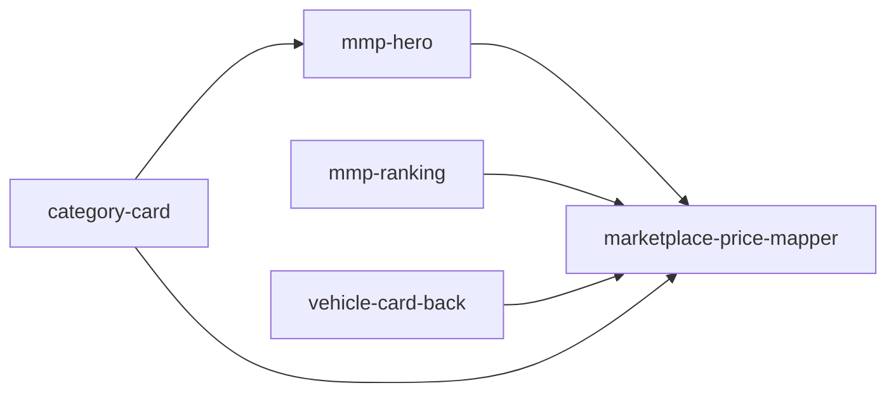

# Unit Dependency DAG

Topology only. Drawn from `components.md`, `decisions.md`, and `units-generation-questions.md` Q2 A / Q3 A. Delivery Planning chooses the economic path through this graph.

U3 and U4 depend on U1 only. U5 (`category-card`) also depends on U2 (`mmp-hero`) so Delivery Planning’s Bolt 4 follows Bolt 1 without changing the mapper star. U3 and U4 do not depend on U2.

## Edges

```yaml
units:
  - name: marketplace-price-mapper
    kind: library
    depends_on: []
  - name: mmp-hero
    kind: ui
    depends_on: [marketplace-price-mapper]
  - name: mmp-ranking
    kind: ui
    depends_on: [marketplace-price-mapper]
  - name: vehicle-card-back
    kind: ui
    depends_on: [marketplace-price-mapper]
  - name: category-card
    kind: ui
    depends_on: [marketplace-price-mapper, mmp-hero]
```



Text fallback: `mmp-hero`, `mmp-ranking`, and `vehicle-card-back` depend on `marketplace-price-mapper`. `category-card` also depends on `mmp-hero` (Bolt 4 after Bolt 1). The mapper depends on nothing. No other edges among UI units.

## Integration points

| From | To | Mechanism | What crosses |
|------|----|-----------|--------------|
| `mmp-hero` | `marketplace-price-mapper` | In-repo library import (Q3 A) | In-flight vs settled marketplace fields, `copyVariant` `hero-range`, existing Original MSRP copy; hide-or-string back |
| `mmp-ranking` | `marketplace-price-mapper` | In-repo library import | Same inputs with `copyVariant` `starting-at`, per row |
| `vehicle-card-back` | `marketplace-price-mapper` | In-repo library import | Same inputs with `copyVariant` `starting-at` |
| `category-card` | `marketplace-price-mapper` | In-repo library import | Same inputs with `copyVariant` `starting-at` from that card's existing `vehicle_models` pair |

No HTTP, event, or package boundary. Each UI unit still owns its own `vehicle_models` query file and adds `price { marketplace { high low } }` (`decisions.md` ADR-002). The mapper does not fetch. Failures on a placement's read stay inside that placement: hide while in flight, then Original MSRP after settle (`requirements.md` FR5).

## Parallel development

Sets with no edge between them (multiple valid topological orderings exist):

- `{ mmp-hero, mmp-ranking, vehicle-card-back }` after `marketplace-price-mapper` exists
- `{ category-card }` after both `marketplace-price-mapper` and `mmp-hero` exist
- Any subset of `{ mmp-hero, mmp-ranking, vehicle-card-back }` may proceed without waiting on another UI unit

`marketplace-price-mapper` has no unit dependency. The four UI units cannot complete their mapper import until U1 exists; they can still prepare query-file and slot work in parallel with it.

This graph does not name a recommended build order or a critical path.
